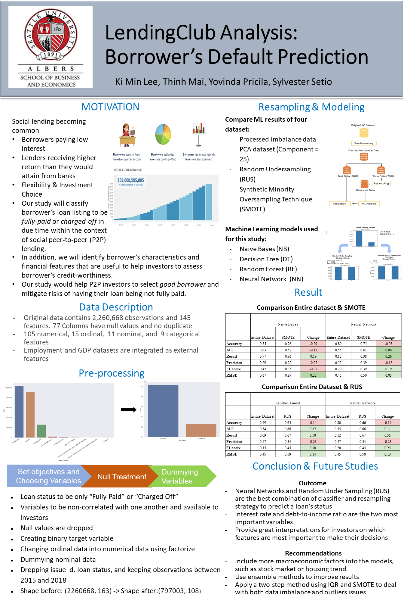

# Lending-Club-Analysis
Machine-learning model for P2P loan default prediction
## Executive Summary
Social lending provides opportunities for micro-loan investors to earn an interest rate higher than savings accounts or traditional finance intermediaries. However, default on social lending loans will result in investors losing their entire principal. Considering these risks on the social lending landscape, our paper will use machine learning algorithms to predict borrower’s default, in hopes to minimize peer-to-peer lending risks. The data used was retrieved from the publicly available LendingClub dataset uploaded through Kaggle. The data provides borrower’s loan listings from April 2008 to September 2018. 

Due to the imbalance classes within the LendingClub loan data, we perform multiple resampling methods - Random Under Sampling (RUS) and Synthetic Minority Oversampling Technique (SMOTE) - to rectify this explored problem. We perform four classifiers - Naive Bayes, Decision Tree, Random Forest, and Neural Network - and compare the predictive power by using the entire dataset and resampled dataset. The RUS technique significantly improved results in comparison with the classifiers. We found that resampling methods are able to boost models’ sensitivity, F1 score, and Area Under Curve (AUC) rate by 55%, 11%, and 25%. respectively. The proposed RUS yields its best result when used with the Neural Network, producing 66% accuracy, 67% recall, and 66% AUC. These results would help investors engaged in social peer-to-peer lending to make calculated, informed decisions when selecting potential borrowers and eliminating higher risks that exist in this platform. 

Technological and financial innovation allows peer-to-peer (P2P) lending to connect lenders to borrowers without the interference of institutional finance intermediaries, such as banks or credit bureau. Social lending has gained popularity and strong momentum, with platforms circulating billion dollar loans. The popularity of these  platforms is growing as recently indicated by LendingClub (LC) which has reached 59.6 billion USD in circulating loans by June 2020, and thus becoming the world’s largest social lending platform (LendingClub.com, 2020). This blossoming of social lending attracts both borrowers and investors due to the lower transaction costs than the traditional financial institutions, allowing borrowers paying lower interest and lenders receiving higher return than they would attain from banks. 

Evaluating the creditworthiness of loan applicants is a challenge in an investor's micro-financing decision, especially in cases where loans are unsecured. Aside from the convenience that social lending provides, the system also introduced lenders to new risks. For instance, lenders may not be repaid in full, borrower’s privacy intrusion, and other issues in the transacting parties (Verstein, 2011). While users rely on LC to facilitate the lending-borrowing connection, no legal financial institution will interpose their credit risks and guarantees. Traditionally, LC accepts fewer than 10% of all applicants to increase their stringent lending criteria (LendingClub.com, 2020). Despite these regulations imposed by LC, investors must be able to identify the borrowers who will pay back their loan in full, within its due time, in order to achieve a good investment. In all, profitability of P2P investors is a pivotal component in continued interest of the social lending market. 

Therefore, the purpose of our study is to identify borrower listings that will likely to pay in full in due time within the context of P2P lending. The analysis would focus to identify the borrower’s characteristics and financial features that would help investors to assess their credit-worthiness. By examining the loan status, we can classify a specific loan as ‘charged-off’ or ‘fully paid’. Charged-off loans are loans that have been declared by a creditor that an amount of the debt is unlikely to be collected. Fully paid loans are loans that have been fully repaid both in principal and its interests. Should the model work, the model will examine the factors that encourage or discourage loan extension and these factors will be put into higher considerations. 

This study proposes and compares different predictive Machine Learning (ML) methods including Naive Bayes (NB), Random Forest (RF), Neural Network (NN), and Decision Tree (DT). The remainder of the study is organized as follows. Section 2 provides literature review on P2P lending. Section 3 provides the data preprocessing techniques to improve data quality. Section 4 presents the classifiers, Section 5 presents the model evaluation. Section 6 presents summary, conclusion, and future research recommendations. 

## Data Source and Data Description
The Lending Club data contains the complete loan data from April 2008 to September 2018. The data has 2,260,668 observations and 145 attributes, such as the credit scores, number of finance inquiries, location (including zip codes and states), and collections among others. Although ID and memberID are the two primary keys, the data source has removed these two columns to protect their customers’ privacy. When building the data dictionary, we observe that our data consists of nominal, ordinal, numerical, and date data types. The data is posted in Kaggle.com, as exported by the LendingClub site. 

We have also done a literature review surrounding the business and the data set. A study conducted by Li et al. suggest subsequent studies to extract, process, and input macroeconomic features into their model. These will be the factors surrounding the loans [5]. Thus, we will be undertaking this suggestion; we agree that macroeconomic factors can often determine each loan’s success factor and, consequently, its rate of return. Therefore, we will be joining the Kaggle data set above with unemployment rates and gross domestic product data per state as provided by the Bureau of Labor Statistics. 

In our data exploration, we have observed several interesting patterns by doing univariate data exploration. The loan amounts range from $0 to $40,000, as previously mentioned by the data description. We also see that the interest rate seems to be positively skewed, with most of the loans having interest rates between 5% to 20% and the skew can range till mid-30%. We also see that most of the loans have B and C grades, followed by A and lower grades. We note that most of our samples seem to be using the 36-months loan rather than its alternative, 60-months loan. Moreover, most of our samples are being done and/or almost being done with their loans, and a relatively small amount of our samples not being able to make full payments. We see that most of our samples are borrowing for the purpose of debt consolidation and repayment of credit cards. We are also seeing that our samples’ age of credits is positively skewed and averaging at around 15 years. 

The important point seems to be the distribution of our samples’ loan status. Our initial dataset is showing an imbalance ratio between default and full-paid history. We will be careful at handling this data, possibly incorporating Costello et al.’s suggestion of using SMOTE, in order to synthetically equate the sample coming from a relatively smaller sample. 

Please contact personally for the original loan.csv dataset at klee1@seattleu.edu 
