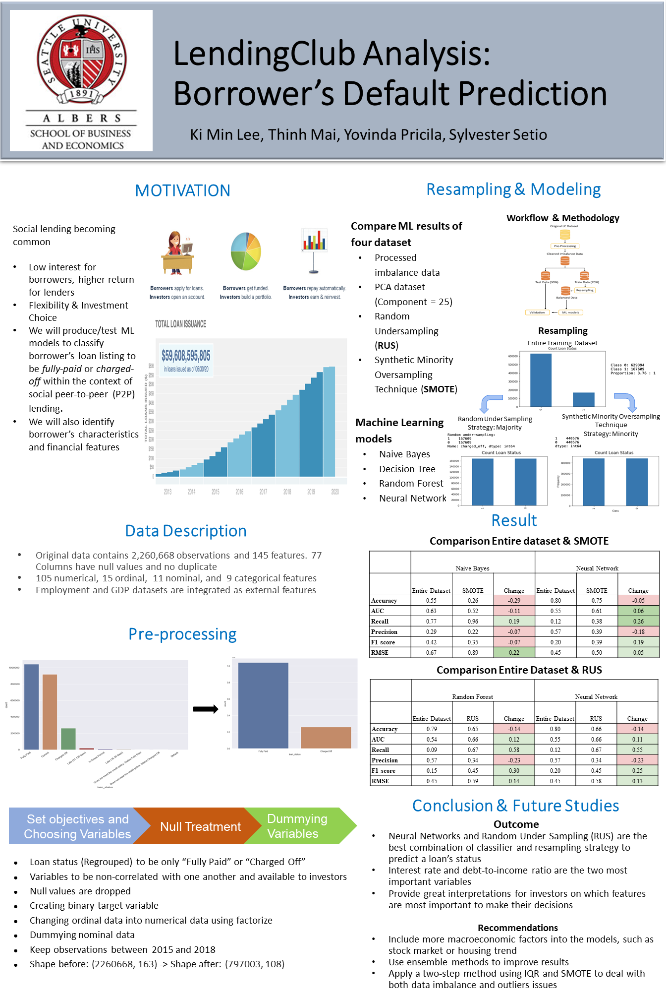

# Lending-Club-Analysis
Machine-learning model for P2P loan default prediction
## Executive Summary
Social lending provides opportunities for micro-loan investors to earn an interest rate higher than savings accounts or traditional finance intermediaries. However, default on social lending loans will result in investors losing their entire principal. Considering these risks on the social lending landscape, we will use machine learning algorithms to predict borrower’s default, in hopes to minimize peer-to-peer lending risks. The data used was retrieved from the publicly available LendingClub dataset uploaded through Kaggle. The data provides borrower’s loan listings from April 2008 to September 2018. 

## Methodology 
* Primary Component Analysis (PCA)
* Random Resampling 
 * Random Under Sampling
 * Synthetic Minority OverSampling Technique
 * Machine Learning Algorithms
  * Naive Bayes Decision Tree
  * Random Forest 
  * Neural Network
  * Gradient Boosting

## Languages & Libraries
* Python
  * numpy
  * pandas
  * scikit-learn
  * matplotlib
  * imblearn
  * statsmodels

## References
1. Hajek, P., & Michalak, K. (2013). Feature selection in corporate credit rating prediction. Knowledge-Based Systems, 51, 72-84. doi:10.1016/j.knosys.2013.07.008. Retrieved July 2, 2020. 
2. Malekipirbazari, M., & Aksakalli, V. (2015). Risk assessment in social lending via random forests. Expert Systems with Applications, 42(10), 4621-4631. doi:10.1016/j.eswa.2015.02.001. Retrieved July 2, 2020. 
3.	Serrano-Cinca, C., Gutiérrez-Nieto, B., & López-Palacios, L. (2015). Determinants of Default in P2P Lending. PLoS ONE, 10(10), 1–22. https://doi-org.proxy.seattleu.edu/10.1371/journal.pone.0139427
4.	Costello, F. J., & Kun Chang Lee. (2019). Exploring the Performance of Synthetic Minority Over-sampling Technique (SMOTE) to Predict Good Borrowers in P2P Lending. Journal of Digital Convergence, 17(9), 71–78. https://doi-org.proxy.seattleu.edu/10.14400/JDC.2019.17.9.071
5.	P. Li and G. Han, LendingClub Loan Default and Profitability Prediction, [online] Available: http://cs229.stanford.edu/proj2018/report/69.pdf. 
6.	Lifeng Zhou, Hong Wang, Loan Default Prediction on Large Imbalanced Data Using Random Frest, TELKOMNKA Indonesian Journal of Electrical Engineering Vol. 10, No.6, October 2012, pp.1519-1525. https://www.researchgate.net/publication/267864165_Loan_Default_Prediction_on_Large_Imbalanced_Data_Using_Random_Forests
7.	Tsai, Kevin, et al. “Peer Lending Risk Predictor.” Researchgate, 2014, www.researchgate.net/profile/Sudhanshu_Singh8/publication/269699712_Peer_Lending_Risk_Predictor/links/549321420cf286fe3125b7d3/Peer-Lending-Risk-Predictor.pdf.
8.	Nnamoko N, Korkontzelos I. Efficient treatment of outliers and class imbalance for diabetes prediction. Artificial Intelligence in Medicine. 2020 Apr;104:101815. DOI: 10.1016/j.artmed.2020.101815,
https://www.sciencedirect.com/science/article/pii/S093336571830681X
9.	Anahita Namvar, et al. “Credit risk prediction in an imbalanced social lending environment.”  Int. J. Comput. Intell. Cyst. 2018,
https://arxiv.org/ftp/arxiv/papers/1805/1805.00801.pdf
10.	Haixiang, G., Yijing, L., Shang, J., Mingyun, G., Yuanyue, H., and Bing, G.: ‘Learning from class- imbalanced data: review of methods and applications’, Expert Systems with Applications, 2017, 73, pp. 220- 239 

Please contact personally for the original loan.csv dataset at klee1@seattleu.edu 
